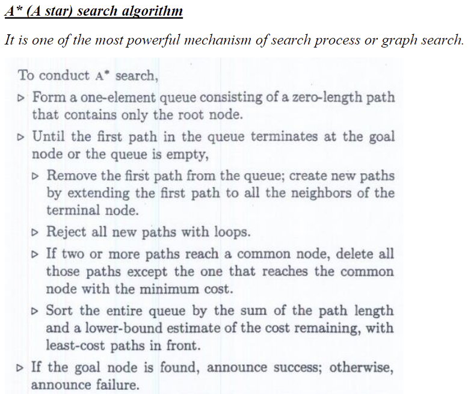
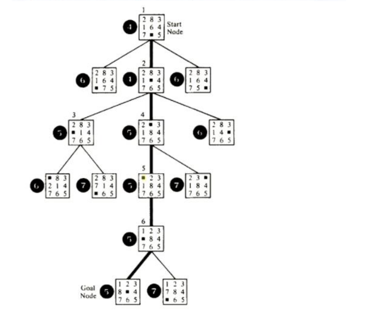

# ECE 479 Homework 3
## How To Compile And Run The Code
The code is written in C++, and can be compiled using the g++ compiler by
running the provided build.sh script. The executable will be named hw3, and
placed in the bin folder. The sequence of compiling and running can be like the
commands below.
```bash
cd ece479-hw3           # go to root folder of project
chmod +x build.sh       # give the build script execute permission
./build.sh              # compile the code
./bin/hw3 astar 1       # solve the puzzle with astar heuristic 1
```

## Given Instructions
Please encode the A* algorithm in C, C++, or a language that we can compile and run 
to investigate the power of heuristics for the A* algorithm using the 8 puzzle 
problem.  Use any two heuristics you may research or invent your own heuristics as 
long as they guarantee the solution optimality. In your write up, please explain how 
those two heuristics compare, and clearly state comparison criteria with respect to 
their efficiency of finding the optimal solutions.

## Pseudocode From Lecture


## Picture From Lecture

